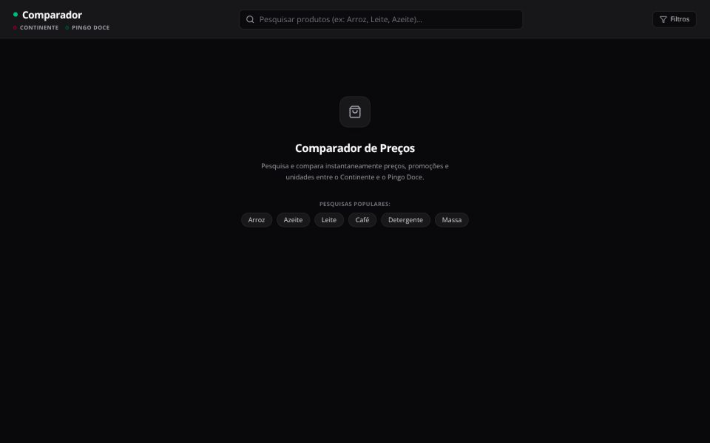

# Comparador

Comparador de preços entre o **Continente** e o **Pingo Doce**. Pesquisa em tempo real nos sites das duas cadeias, extrai produtos, preços e promoções e apresenta-os lado a lado.

🔗 Demo ao vivo: **https://comparador-fawn.vercel.app/**



## Stack

Um único projeto **Next.js** que serve o frontend e a própria API — sem servidores separados, sem chaves de API, sem serviços de scraping externos.

| Camada | Tecnologia | Onde no repo |
| --- | --- | --- |
| Framework | Next.js 15 (App Router) + React 19 | `app/`, `next.config.ts` |
| Linguagem | TypeScript 5.9 | todo o código `.ts`/`.tsx` |
| Estilos | Tailwind CSS 4 (PostCSS) + `@tailwindcss/typography` | `app/globals.css`, `tailwind()`-free/native config |
| Componentes | Radix UI (checkbox, popover, slot) + class-variance-authority + tailwind-merge + tw-animate-css | `components/` |
| Ícones | lucide-react | `components/` |
| Scraping | cheerio, corre no servidor (Node Route Handlers) | `lib/scraper/`, `app/api/` |
| Testes | Vitest (parsers puros + fixtures de HTML real) | `tests/` |
| Linting | ESLint 9 + `eslint-config-next` | `eslint.config.mjs` |
| Toolchain | Bun (instalação, dev, build) | `package.json` (`packageManager`) |
| CI/CD | GitHub Actions | `.github/workflows/ci.yml` |
| Runtime | Node.js 22 (imagem Docker `standalone`) | `Dockerfile` |
| Hosting | Vercel Functions (região `fra1` via `vercel.json`) | `vercel.json` |

### Como funciona

O frontend consome a própria API `same-origin`. Cada loja tem Route Handlers Node.js (`app/api/{continente,pingodoce}/{search,suggestions}/route.ts`) que fazem scraping do site com `fetch` + headers de browser, parsers **puros** (`lib/scraper/`) convertem o HTML em `Product[]`, e os resultados voltam como JSON tipado (`lib/types.ts`). Os parsers recebem HTML e devolvem objetos — sem I/O — pelo que são unit-testados contra fixtures capturadas dos sites reais.

## Arquitetura

```
app/
  page.tsx                        # Composição da página (pesquisa, filtros, resultados)
  api/
    health/route.ts               # Liveness + sonda de disponibilidade das lojas
    {continente,pingodoce}/
      search/route.ts             # GET /api/<loja>/search?q=…&start=…
      suggestions/route.ts        # GET /api/<loja>/suggestions?q=…
lib/
  scraper/                        # Camada de domínio: scraping das duas lojas
    http.ts                       # fetch com headers de browser, timeout e sem cache
    errors.ts                     # ScraperError tipado
    continente.ts                 # Parsers puros + clientes Continente
    pingodoce.ts                  # Parsers puros + clientes Pingo Doce
    probe.ts                      # Sonda leve de reachability
  api/parse.ts                    # Validação dos parâmetros de query
  types.ts                        # Contratos da API partilhados frontend/backend
  format.ts                       # Parsing/formatação de preços em pt-PT
components/                       # UI (cards, filtros, skeletons)
tests/                            # Testes unitários + fixtures do markup das lojas
```

Princípios seguidos:

- **Parsers puros e testáveis**: `parseContinenteProducts(html)` e `parsePingoDoceProducts(html)` recebem HTML e devolvem `Product[]` — sem I/O, fáceis de testar contra fixtures.
- **Routes finas**: os Route Handlers apenas validam a query, delegam no scraper e mapeiam erros → `400`/`500`.
- **Sem dados inventados**: a engine substituiu os mocks originais; tudo o que é devolvido vem dos sites reais.

## API

| Endpoint | Descrição |
| --- | --- |
| `GET /api/continente/search?q=arroz&start=0` | Produtos do Continente |
| `GET /api/pingodoce/search?q=arroz&start=0` | Produtos do Pingo Doce |
| `GET /api/continente/suggestions?q=arr` | Sugestões de pesquisa (Continente) |
| `GET /api/pingodoce/suggestions?q=arr` | Sugestões de pesquisa (Pingo Doce) |
| `GET /api/health` | Status do serviço + lojas alcançáveis |

Resposta de pesquisa:

```json
{
  "query": "arroz",
  "count": 2,
  "products": [
    {
      "id": "4949515",
      "brand": "Continente",
      "nome": "Arroz Basmati Continente",
      "price": 1.89,
      "desconto": null,
      "pvp_recomendado": null,
      "promocao": null,
      "preco_por_volume": "1,89 €/kg",
      "category": "Mercearia",
      "embalagem": "emb. 1 kg",
      "link_produto": "https://www.continente.pt/produto/…",
      "link_imagem": "https://…",
      "ivazero": false
    }
  ]
}
```

## Desenvolvimento local

```bash
bun install
bun run dev       # http://localhost:3000
```

Verificação de qualidade:

```bash
bun run lint      # ESLint
bun run test      # Vitest (parsers + utils)
bun run build     # produção (inclui lint)
```

## Deploy — Vercel (tier grátis, recomendado)

O `vercel.json` na raiz fixa as funções na região `fra1` (Frankfurt), a mais próxima dos sites das lojas. Não são precisas variáveis de ambiente; os Route Handlers correm em Node.js e todo o tráfego é `same-origin`.

1. Repositório no GitHub (pode ficar privado).
2. [vercel.com](https://vercel.com) → sign in com GitHub → **Add New Project**.
3. Importar o repositório `Comparador` (o preset **Next.js** é detetado automaticamente; o `packageManager` em `package.json` manda o Vercel usar Bun).
4. Se o Vercel não detetar o bun: em *Settings → Build*, definir Install Command `bun install` e Build Command `bun run build`.
5. **Deploy**.
6. Deploy atual: **https://comparador-fawn.vercel.app**.

Verificação do deploy atual:

```bash
curl https://comparador-fawn.vercel.app/api/health
curl "https://comparador-fawn.vercel.app/api/continente/search?q=arroz"
curl "https://comparador-fawn.vercel.app/api/pingodoce/search?q=azeite"
```

**Caveat conhecido**: os sites das lojas usam CDN/bot-protection; IPs de datacenter podem ser bloqueados (`403`) mesmo que funcionem a partir de casa. É o primeiro sinal a verificar no passo 6.

## Deploy alternativo — Northflank (tier grátis)

A imagem é um Next.js `standalone` num `Dockerfile` multi-stage (bun a instalar/buildar, Node 22 a correr). O tier Sandbox gratuito da Northflank oferece *always-on* compute (sem sleep) e 2 serviços.

1. Repositório no GitHub (pode ficar privado).
2. [northflank.com](https://northflank.com) → criar projeto.
3. Ligar o GitHub e **autorizar o app Northflank** com acesso ao repositório `Comparador`.
4. Criar serviço a partir do repo — o `Dockerfile` é detetado automaticamente.
5. Configurar no serviço: porta interna `3000`, health check em `/api/health`.
6. Deploy. O URL atribuído não exige alterações ao código (tudo é `same-origin`).

Aplica-se o mesmo caveat de bloqueio por IP de datacenter referido na secção Vercel.

## CI

`.github/workflows/ci.yml` corre `bun install --frozen-lockfile` → `lint` → `test` → `build` em pushes para `main` e em pull requests.